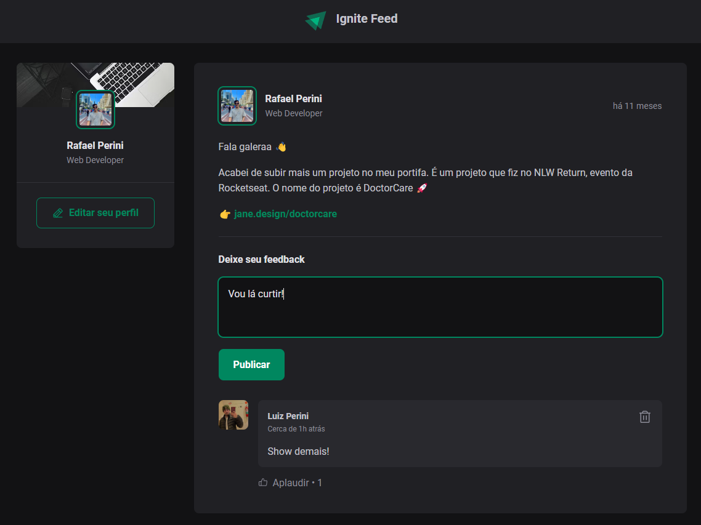

# Ignite Feed

## Descrição

Uma aplicação React simples, construída com Vite e TypeScript, que simula um feed de um fórum com funcionalidades básicas de comentários, curtidas e deleções. O objetivo deste projeto foi praticar os conceitos fundamentais do React, como componentes, estado e hooks.



## Tecnologias

* React
* Vite
* TypeScript

## Como executar o projeto

1. **Clone o repositório:**
  ```bash
  git clone https://github.com/faelperini/01-ignite-feed
  ```

2. **Instale as dependências:**
  ```bash
  cd 01-ignite-feed
  npm install
  ```

3. **Inicie o desenvolvimento:**
  ```Bash
  npm run dev
  ```

O aplicativo será iniciado em http://localhost:5173/

## Funcionalidades

**Feed de posts:** Exibe uma lista de posts estáticos.<br>

**Comentários:** Permite adicionar, curtir e deletar comentários em cada post.
